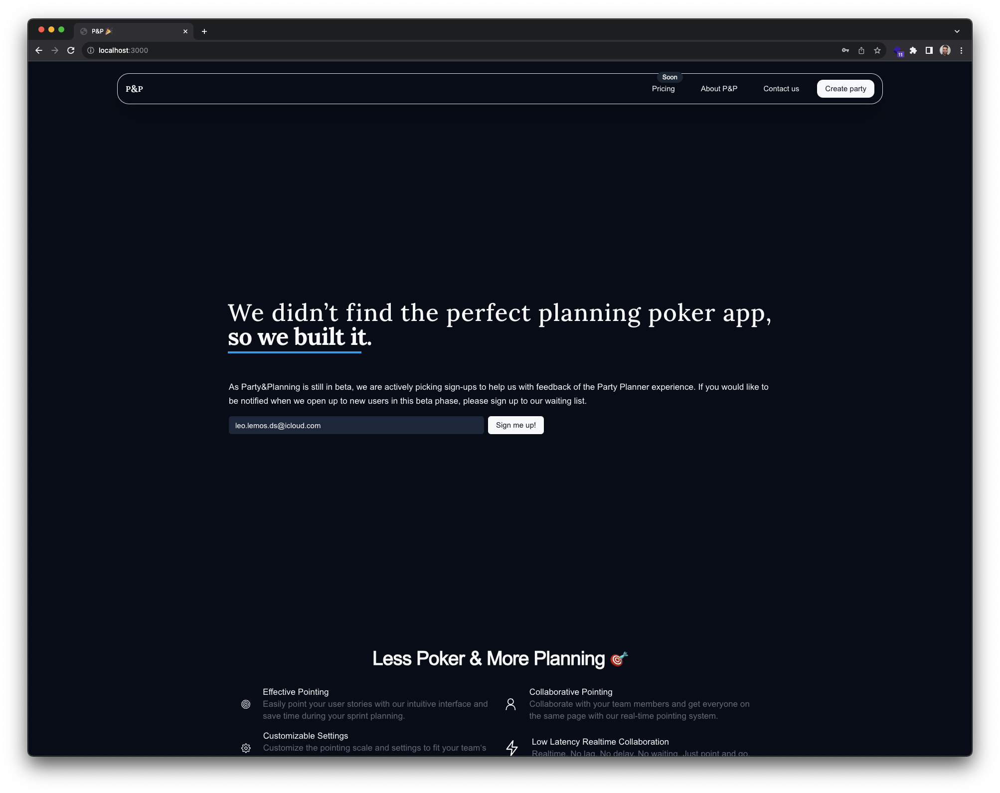

# Planria

Planria is the planning poker project that we are working on to provide a better experience for the planning poker process and enrich the Scrum experience for the thousands of teams around the world. 🌎

## What is planning poker?

Planning poker is a consensus-based, *gamified* (if that's even a word already) technique for estimating, mostly used to estimate effort or relative size of development goals in software development. In planning poker, members of the group make estimates by playing numbered cards face-down to the table, instead of speaking them aloud. The cards are revealed, and the estimates are then discussed. By hiding the figures in this way, the group can avoid the cognitive bias of anchoring, where the first number spoken aloud sets a precedent for subsequent estimates. If you want to deepen into furthermore detail, here's the link to the [Wikipedia page on Planning poker](https://en.wikipedia.org/wiki/Planning_poker).

## What is Scrum? 🤔

Scrum is a framework for project management that emphasizes teamwork, accountability and iterative progress toward a well-defined goal. The framework begins with a simple premise: Start with what can be seen or known. After that, track the progress and tweak as necessary. If you want to deepen into furthermore detail, here's the link to the [Wikipedia page on Scrum](https://en.wikipedia.org/wiki/Scrum_(software_development)).

## What is a Scrum team? 🤔

A Scrum team is a collection of individuals working together to deliver the requested and committed product increments. The Scrum team is self-organizing, even though there may be some level of hierarchy within the team. The Scrum team is cross-functional, meaning that the team has all the necessary skills to complete the work it commits to. The Scrum team is also self-managing, meaning that the team internally decides who does what, when and how. If you want to deepen into furthermore detail, here's the link to the [Wikipedia page on Scrum team](https://en.wikipedia.org/wiki/Scrum_(software_development)#Scrum_team).

## How can Planria help you?

Planria provides a simple and feature-rich platform that contains all the necessary tools to make the planning poker process as smooth as possible. It provides a simple and intuitive interface that allows the Scrum team to focus on the task at hand and not on the tools. It also provides a rich set of features that can be used to enrich the Scrum experience so at least your three-hour long planning poker sessions are not as boring as they used to be. 😅

**We know that it is hard to find a good planning poker tool** and stick to it; and the many of those out there that we've tested throughout these years have been lacking in one way or another. That's why we've decided to create our own tool and make it available for everyone to use. We hope that you find it useful and that it helps you to make your Scrum experience more enjoyable. 🤗

**We suffered** from this problem ourselves.

## License

The Party&Planning project is licensed under the [Apache License 2.0](https://www.apache.org/licenses/LICENSE-2.0) license. You can find a copy of the license in the [LICENSE](./LICENSE) file or at <https://www.apache.org/licenses/LICENSE-2.0>.

## Buy me a Coffee ☕️

If you like this project and want to support me, consider buying me a coffee. I would really appreciate it if you keep me addicted! (I'm kidding) 😊

